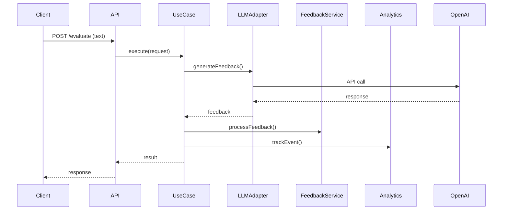
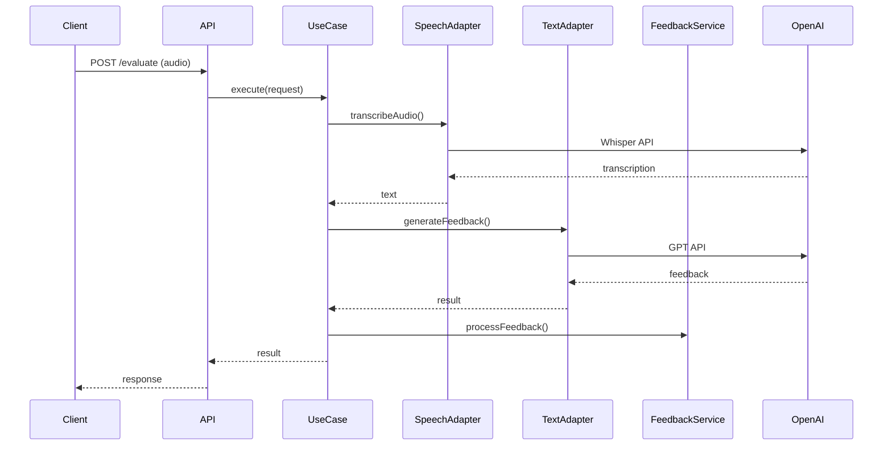
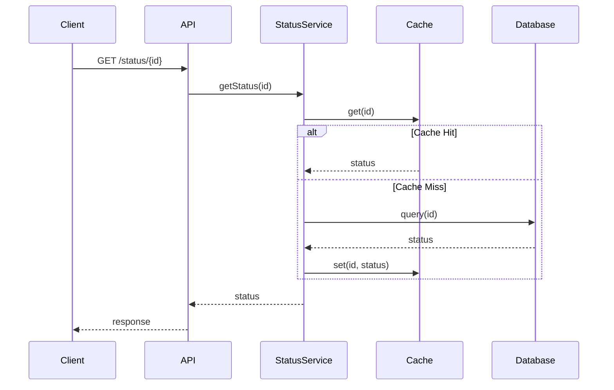

# Architecture Guide

## System Overview

The LLM Feedback Engine follows Onion Architecture (Clean Architecture) principles, ensuring clear separation of concerns and maintainable code structure.

## Architecture Layers

### Domain Layer (Core)

The innermost layer containing business logic and entities.

```
src/lib/llm/domain/
├── entities/           # Core business objects
│   ├── Submission.ts   # Evaluation submission
│   ├── Feedback.ts     # Generated feedback
│   ├── EvaluationRequest.ts
│   └── EvaluationStatus.ts
├── interfaces/         # Contracts and abstractions
│   ├── ILLMAdapter.ts  # LLM service interface
│   ├── IAnalyticsService.ts
│   └── IStatusTrackingService.ts
└── services/          # Business services
    ├── FeedbackService.ts
    └── StatusTrackingService.ts
```

### Application Layer

Contains use cases and application services that orchestrate domain logic.

```
src/lib/llm/application/
├── use-cases/
│   └── EvaluateSubmissionUseCase.ts
└── services/
    └── LLMFeedbackService.ts
```

### Infrastructure Layer

External dependencies and adapters.

```
src/lib/llm/infrastructure/
├── openai/
│   ├── OpenAITextAdapter.ts
│   └── OpenAISpeechAdapter.ts
├── analytics/
│   └── PostHogAnalyticsService.ts
├── monitoring/
│   └── SentryMonitoringService.ts
└── retry/
    ├── RetryService.ts
    └── CircuitBreaker.ts
```

## Key Design Patterns

### 1. Adapter Pattern

Used for integrating with external services (OpenAI, PostHog, Sentry):

```typescript
interface ILLMAdapter {
  generateFeedback(request: EvaluationRequest): Promise<Feedback>;
  transcribeAudio(audioUrl: string): Promise<string>;
}
```

### 2. Use Case Pattern

Encapsulates business logic for specific operations:

```typescript
class EvaluateSubmissionUseCase {
  constructor(
    private llmAdapter: ILLMAdapter,
    private feedbackService: FeedbackService,
    private statusService: StatusTrackingService
  ) {}

  async execute(request: EvaluationRequest): Promise<EvaluationResponse> {
    // Orchestrate the evaluation process
  }
}
```

### 3. Repository Pattern

Abstracts data access (implemented via services):

```typescript
interface IStatusRepository {
  saveStatus(status: EvaluationStatus): Promise<void>;
  getStatus(submissionId: string): Promise<EvaluationStatus | null>;
}
```

### 4. Circuit Breaker Pattern

Protects against cascading failures:

```typescript
class CircuitBreaker {
  private state: 'CLOSED' | 'OPEN' | 'HALF_OPEN' = 'CLOSED';
  private failureCount = 0;
  private lastFailureTime = 0;

  async execute<T>(operation: () => Promise<T>): Promise<T> {
    // Circuit breaker logic
  }
}
```

## Data Flow

### Text Evaluation Flow



### Audio Evaluation Flow



### Status Tracking Flow



## Error Handling Strategy

### 1. Layered Error Handling

```typescript
// Domain errors
class EvaluationError extends Error {
  constructor(message: string, public code: string) {
    super(message);
  }
}

// Infrastructure errors
class OpenAIAPIError extends Error {
  constructor(message: string, public statusCode: number) {
    super(message);
  }
}

// Application error handling
try {
  const result = await useCase.execute(request);
  return result;
} catch (error) {
  if (error instanceof EvaluationError) {
    return createErrorResponse(error.message, error.code, 400);
  }
  if (error instanceof OpenAIAPIError) {
    return createErrorResponse('AI service unavailable', 'AI_SERVICE_ERROR', 503);
  }
  return createErrorResponse('Internal server error', 'INTERNAL_ERROR', 500);
}
```

### 2. Retry Strategy

```typescript
class RetryService {
  async executeWithRetry<T>(
    operation: () => Promise<T>,
    maxRetries = 3,
    baseDelay = 1000
  ): Promise<T> {
    for (let attempt = 1; attempt <= maxRetries; attempt++) {
      try {
        return await operation();
      } catch (error) {
        if (attempt === maxRetries || !this.isRetryableError(error)) {
          throw error;
        }
        await this.delay(baseDelay * Math.pow(2, attempt - 1));
      }
    }
  }
}
```

## Performance Considerations

### 1. Caching Strategy

- **Response Caching**: Cache evaluation results for identical inputs
- **Status Caching**: Cache evaluation status in Redis
- **Model Caching**: Cache OpenAI model responses when appropriate

### 2. Async Processing

- **Non-blocking Operations**: Use async/await throughout
- **Background Processing**: Long-running evaluations in background
- **Streaming Responses**: Real-time status updates via WebSocket

### 3. Resource Management

- **Connection Pooling**: Reuse HTTP connections
- **Memory Management**: Proper cleanup of large objects
- **Rate Limiting**: Respect OpenAI API limits

## Security Architecture

### 1. Input Validation

```typescript
const EvaluationRequestSchema = z.object({
  content: z.string().optional(),
  audioUrl: z.url().optional(),
  question: z.string().min(1).max(1000),
  context: z.object({
    role: z.string().optional(),
    company: z.string().optional(),
  }).optional(),
});
```

### 2. API Key Management

- Environment variable storage
- Secure key rotation
- No key exposure in logs

### 3. Data Sanitization

- Remove sensitive data from logs
- Sanitize error messages
- Validate all inputs

## Monitoring and Observability

### 1. Metrics Collection

```typescript
// Custom metrics
const metrics = {
  evaluationRequests: new Counter('evaluation_requests_total'),
  evaluationDuration: new Histogram('evaluation_duration_seconds'),
  openaiApiErrors: new Counter('openai_api_errors_total'),
};
```

### 2. Logging Strategy

```typescript
// Structured logging
logger.info('Evaluation started', {
  submissionId,
  userId,
  questionType,
  timestamp: new Date().toISOString(),
});
```

### 3. Health Checks

```typescript
// Health check endpoint
app.get('/health', async (req, res) => {
  const health = {
    status: 'healthy',
    timestamp: new Date().toISOString(),
    services: {
      openai: await checkOpenAIConnection(),
      database: await checkDatabaseConnection(),
      cache: await checkCacheConnection(),
    },
  };
  res.json(health);
});
```

## Scalability Considerations

### 1. Horizontal Scaling

- Stateless service design
- Load balancer ready
- Database connection pooling

### 2. Vertical Scaling

- Memory-efficient processing
- CPU optimization
- I/O optimization

### 3. Caching Strategy

- Redis for session storage
- CDN for static assets
- Application-level caching

## Deployment Architecture

### Development Environment

```
┌─────────────┐    ┌─────────────┐    ┌─────────────┐
│   Client    │───▶│   Next.js   │───▶│   Supabase  │
│  (Browser)  │    │   (Local)   │    │   (Cloud)   │
└─────────────┘    └─────────────┘    └─────────────┘
                           │
                           ▼
                   ┌─────────────┐
                   │   OpenAI    │
                   │   (Cloud)   │
                   └─────────────┘
```

### Production Environment

```
┌─────────────┐    ┌─────────────┐    ┌─────────────┐
│   CDN       │───▶│   Load      │───▶│   Next.js   │
│  (CloudFlare)│    │  Balancer   │    │  (Vercel)   │
└─────────────┘    └─────────────┘    └─────────────┘
                           │
                           ▼
                   ┌─────────────┐    ┌─────────────┐
                   │   Redis     │    │   Supabase  │
                   │   (Upstash) │    │   (Cloud)   │
                   └─────────────┘    └─────────────┘
                           │
                           ▼
                   ┌─────────────┐
                   │   OpenAI    │
                   │   (Cloud)   │
                   └─────────────┘
```

## Future Enhancements

### 1. Microservices Architecture

- Split into separate services
- API Gateway integration
- Service mesh implementation

### 2. Event-Driven Architecture

- Event sourcing for evaluations
- CQRS pattern implementation
- Message queue integration

### 3. Advanced AI Features

- Custom model fine-tuning
- Multi-model ensemble
- Real-time learning from feedback
